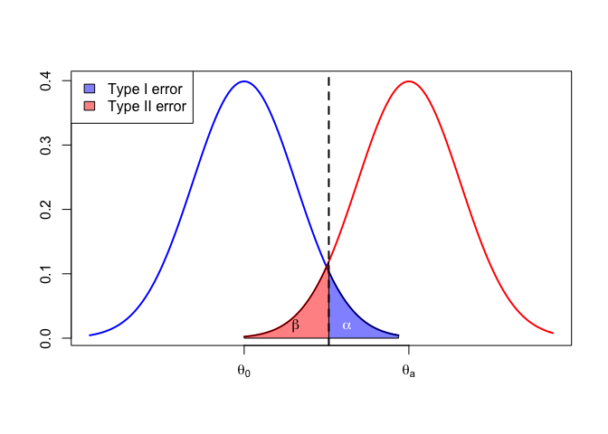

Assignment Four for Lab4
================
Taehoon Ha
10/05/2018

### 1. Read chapter 5 from "Advanced R, 2nd ed." H. Wickham (available online).

### 2. Create a GitHub repository Lab4 (files with R code for the assignment should be added to this repository)

### 3. Write the R code using ggplot function to recreate the graph from the Lecture 8 notes


``` r
ggplot(NULL, aes(x = c(-3, 6), y = c(0, 0.4))) +
  stat_function(fun = dnorm,
                args = list(mean = 0, sd = 1),
                lwd = 1,
                xlim = c(-3, 3),
                color = 'blue') +
  stat_function(fun = dnorm,
                xlim = c(qnorm(0.95), 3),
                geom = "area",
                alpha = 0.4,
                color = 'black',
                aes(fill = 'a')) + 
  stat_function(fun = dnorm,
                args = list(mean = 3.2, sd = 1),
                lwd = 1,
                xlim = c(0, 6),
                color = 'red') +
  stat_function(fun = dnorm,
                args = list(mean = 3.2, sd = 1),
                xlim = c(0, qnorm(0.95)), 
                geom = "area",
                alpha = 0.4,
                color = 'black',
                aes(fill = 'b')) +
  xlab("") +
  ylab("") +
  geom_vline(xintercept = qnorm(0.95),
             linetype = 'longdash',
             lwd = 0.7) +
  theme(panel.background = element_blank(),
        panel.border = element_rect(color = 'black',
                                    fill = NA),
        legend.title = element_blank(),
        legend.justification = c(0, 1),
        legend.position = c(0, 1),
        legend.box.margin = margin(c(1, 1, 1, 1)),
        legend.box.background = element_rect(color = 'black',
                                             fill = NA),
        legend.text = element_text(size = 14,
                                   margin = margin(l = 10)),
        axis.text.x = element_text(hjust = 0.5,
                                   size = 14,
                                   color = 'black',
                                   margin = margin(10, 0, 0, 0)),
        axis.text.y = element_text(angle = 90, 
                                   hjust = 0.5, 
                                   size = 14, 
                                   color = 'black',
                                   margin = margin(0, 10, 0, 0)),
        axis.ticks.length = unit(0.25, "cm")) +
  annotate("text", 
           x = 2,
           y = 0.02, 
           label = expression(alpha),
           color = 'white',
           size = 5) +
  annotate("text",
           x = 1,
           y = 0.02,
           label = expression(beta),
           color = 'black',
           size = 5) +
  scale_fill_manual(values = c("a" = "blue",
                                 "b"= "red"), 
                      label = c("Type I error",
                                "Type II error")) +
  scale_x_continuous(breaks = c(0, 3.2), 
                     labels = c(expression(theta[0]), expression(theta[1])))
```



### 4. Implement a function that will check if a given positive integer is a prime number.

``` r
is.prime <- function (num) {
  # Check if the input is numeric.
  if (is.numeric(num) == F) {
    stop("The input should be a numeric value.")
    } else {
      # Check if the input is integer.
      check.integer <- function (num) {
        !grepl("[^[:digit:]]", format(num, digits = 20, scientific = F))
      }
      if (check.integer(num) == F) {
        stop("The input should be a positive integer.")
        } 
      else {
        # Check if the input is greater than +1.
        if (num <= 1) {
          return(F)
        } else if (num <= 3) {
            return(T)
        } else if (num %% 2 == 0 | num %% 3 == 0) {
            return(F)
          } else {
            i <- 5
            while (i * i <= num) {
              if (num %% i == 0 | num %% (i + 2) == 0) {
                return(F)
                } 
              i <- i + 6
              } 
            return(T)
          }
      }
    }
}
```

### Test Sets

#### 4.1 If the input is not numeric,

``` r
is.prime("Oleksandr")
```

    ## Error in is.prime("Oleksandr"): The input should be a numeric value.

#### 4.2 If the input is not integer,

``` r
is.prime(123.123)
```

    ## Error in is.prime(123.123): The input should be a positive integer.

#### 4.3 If the input is negative,

``` r
is.prime(-1)
```

    ## Error in is.prime(-1): The input should be a positive integer.

#### 4.4 From 0 to 100

``` r
for (i in 0:100) {
  if (is.prime(i) == T) {
    print(i)
  } else {
    print("No Prime")
  }
}
```

    ## [1] "No Prime"
    ## [1] "No Prime"
    ## [1] 2
    ## [1] 3
    ## [1] "No Prime"
    ## [1] 5
    ## [1] "No Prime"
    ## [1] 7
    ## [1] "No Prime"
    ## [1] "No Prime"
    ## [1] "No Prime"
    ## [1] 11
    ## [1] "No Prime"
    ## [1] 13
    ## [1] "No Prime"
    ## [1] "No Prime"
    ## [1] "No Prime"
    ## [1] 17
    ## [1] "No Prime"
    ## [1] 19
    ## [1] "No Prime"
    ## [1] "No Prime"
    ## [1] "No Prime"
    ## [1] 23
    ## [1] "No Prime"
    ## [1] "No Prime"
    ## [1] "No Prime"
    ## [1] "No Prime"
    ## [1] "No Prime"
    ## [1] 29
    ## [1] "No Prime"
    ## [1] 31
    ## [1] "No Prime"
    ## [1] "No Prime"
    ## [1] "No Prime"
    ## [1] "No Prime"
    ## [1] "No Prime"
    ## [1] 37
    ## [1] "No Prime"
    ## [1] "No Prime"
    ## [1] "No Prime"
    ## [1] 41
    ## [1] "No Prime"
    ## [1] 43
    ## [1] "No Prime"
    ## [1] "No Prime"
    ## [1] "No Prime"
    ## [1] 47
    ## [1] "No Prime"
    ## [1] "No Prime"
    ## [1] "No Prime"
    ## [1] "No Prime"
    ## [1] "No Prime"
    ## [1] 53
    ## [1] "No Prime"
    ## [1] "No Prime"
    ## [1] "No Prime"
    ## [1] "No Prime"
    ## [1] "No Prime"
    ## [1] 59
    ## [1] "No Prime"
    ## [1] 61
    ## [1] "No Prime"
    ## [1] "No Prime"
    ## [1] "No Prime"
    ## [1] "No Prime"
    ## [1] "No Prime"
    ## [1] 67
    ## [1] "No Prime"
    ## [1] "No Prime"
    ## [1] "No Prime"
    ## [1] 71
    ## [1] "No Prime"
    ## [1] 73
    ## [1] "No Prime"
    ## [1] "No Prime"
    ## [1] "No Prime"
    ## [1] "No Prime"
    ## [1] "No Prime"
    ## [1] 79
    ## [1] "No Prime"
    ## [1] "No Prime"
    ## [1] "No Prime"
    ## [1] 83
    ## [1] "No Prime"
    ## [1] "No Prime"
    ## [1] "No Prime"
    ## [1] "No Prime"
    ## [1] "No Prime"
    ## [1] 89
    ## [1] "No Prime"
    ## [1] "No Prime"
    ## [1] "No Prime"
    ## [1] "No Prime"
    ## [1] "No Prime"
    ## [1] "No Prime"
    ## [1] "No Prime"
    ## [1] 97
    ## [1] "No Prime"
    ## [1] "No Prime"
    ## [1] "No Prime"
